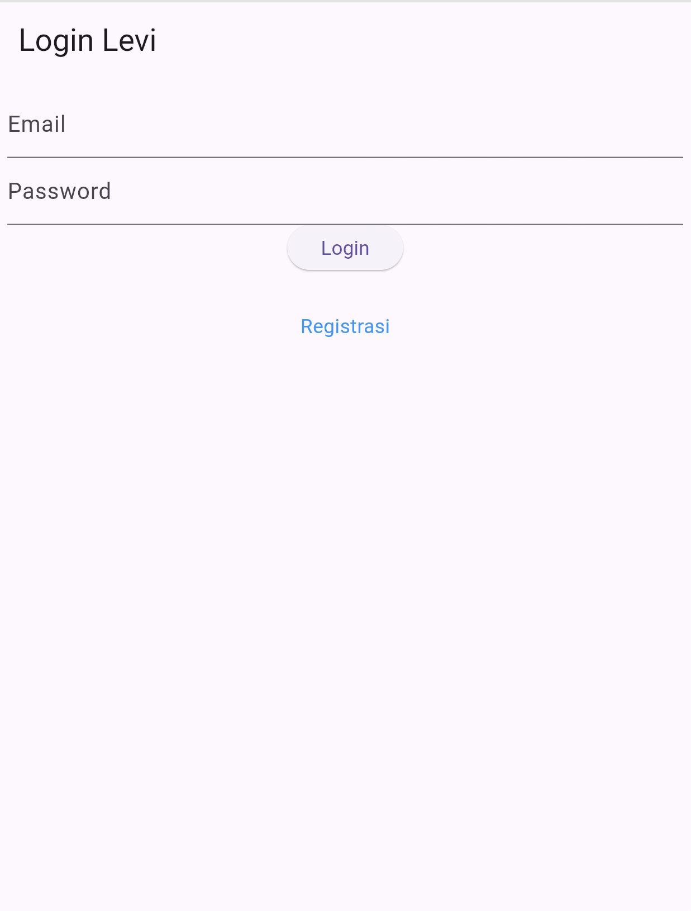
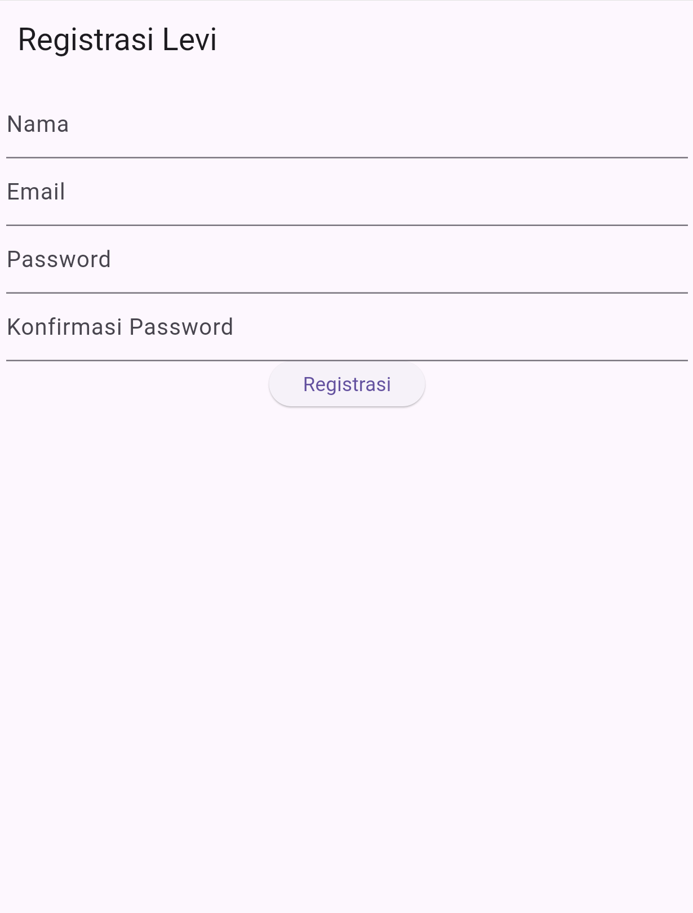
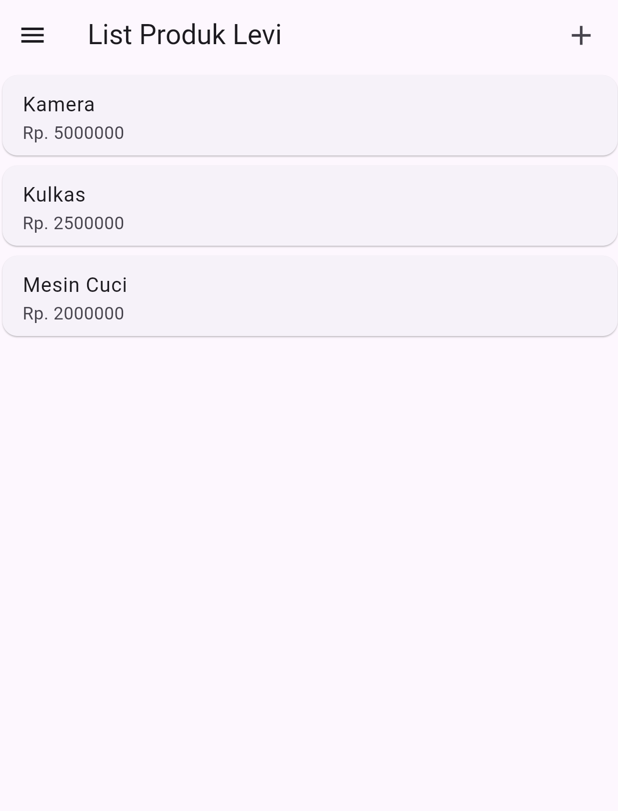
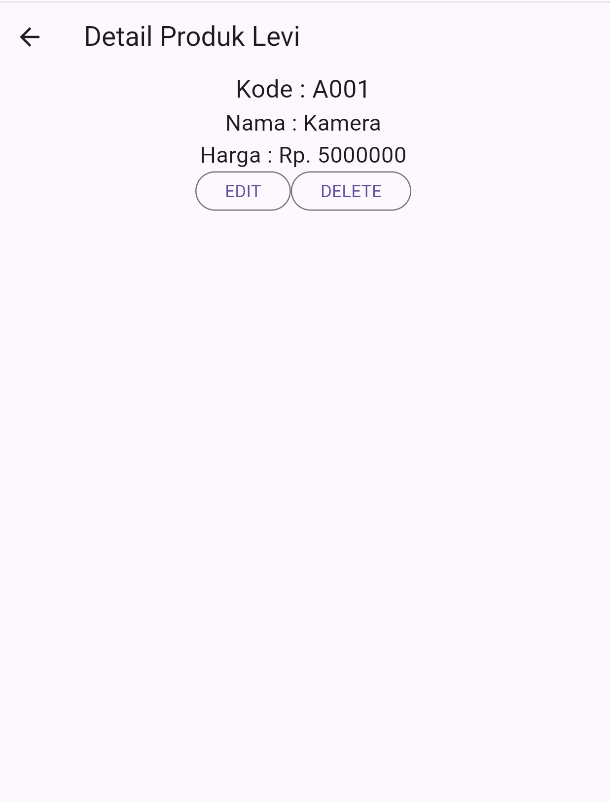
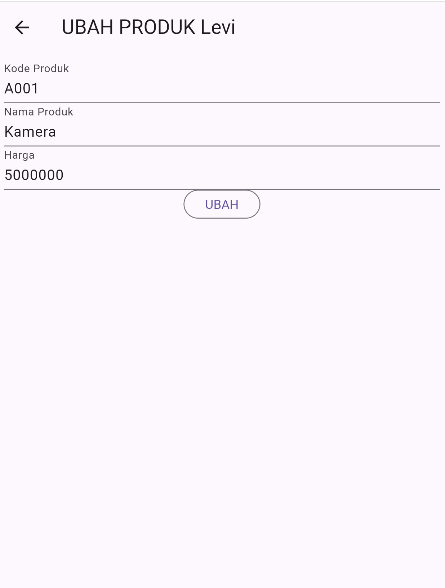

# Tugas Pertemuan 3

Selesaikan kode pada pertemuan 4 hingga UI nya selesai, kemudian tambahkan nama panggilan kalian pada setiap action bar misal : Tambah Produk Bisma, List Produk Bisma, Detail Produk Bisma, dll.
Screenshot semua halaman UI yang sudah terbentuk dan masukkan ke file Readme.

NB : Buat repository baru untuk pertemuan 4, eg: LabMobile4_Nama_ShiftBaru

Hal yang perlu dikumpulkan :
Link Repo berisi Source Code
Readme.md yang berisi SS tampilan aplikasi Anda.

Nama : Muhammad Levi Asshidiqi

NIM : H1D022103

Shift Baru: A

file `ui/Login_page.dart`
## Screenshot
Contoh :

file `ui/Registrasi_page.dart`
## Screenshot

file `ui/ListProduk.dart`
## Screenshot

file `ui/DetailProduk.dart`
## Screenshot

file `ui/UbahProduk.dart`
## Screenshot

